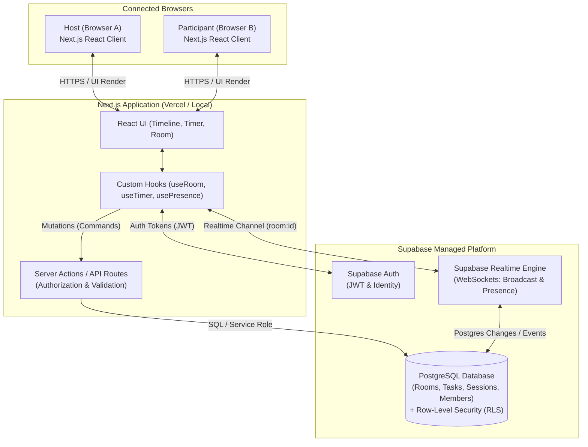

# StudySync — Phase 1 System Architecture Overview

This document defines the high-level architecture, technology stack, state boundaries, data flow, and synchronization model for **Phase 1 (MVP)** of StudySync.

---

## 1. Executive Summary & Recommended Stack

StudySync is a real-time collaborative study room where participants organize tasks along a shared horizontal timeline and execute them together using synchronized timers and session controls.

For Phase 1, we adopt a **modern fullstack TypeScript architecture** leveraging a managed PostgreSQL Backend-as-a-Service (Supabase):

```text
┌───────────────────────────────────────────────────────────┐
│                     FRONTEND / CLIENT                     │
│    Next.js (App Router) + React + TypeScript + Tailwind   │
└─────────────────────────────┬─────────────────────────────┘
                              │
               HTTPS / WSS    │   Client SDK & Server API
                              ▼
┌───────────────────────────────────────────────────────────┐
│                      BACKEND (BaaS)                       │
│    Supabase: PostgreSQL DB + Auth + Realtime Engine       │
└───────────────────────────────────────────────────────────┘
```

### Component Stack Summary

| Layer | Selected Technology | Purpose |
| :--- | :--- | :--- |
| **Frontend Framework** | **Next.js (App Router) + React** | Interactive timeline UI, room routing, server/client components |
| **Language** | **TypeScript** | Strict compile-time type safety across UI, DB models, and events |
| **Styling** | **Tailwind CSS** | Responsive timeline layouts, design tokens, utility-based UI |
| **Database** | **PostgreSQL (Supabase)** | Relational storage for rooms, tasks, sessions, and permissions |
| **Authentication** | **Supabase Auth** | Anonymous / magic link / email auth, user identities, JWTs |
| **Realtime Engine** | **Supabase Realtime** | WebSockets for presence (who is online) and room event broadcasting |
| **Tooling & VCS** | **npm & Git/GitHub** | Dependency management, branch protection, pair PR reviews |

---

## 2. Why Each Technology is Needed

1. **Next.js (App Router) & React**:
   - **Interactive UI**: Real-time collaborative timelines require rich DOM updates and dynamic state reflection.
   - **Route Handling**: Clean dynamic routes like `/room/[roomId]` for instant shareable room links.
   - **Server Components & API Routes**: Enables secure server-side mutations, timestamp validation, and authorization without exposing secret logic to the client.
2. **TypeScript**:
   - Acts as a contract between the database schema, API responses, and UI components.
   - Prevents common beginner runtime bugs (e.g. undefined variable access, missing object properties).
3. **Tailwind CSS**:
   - Provides rapid styling without CSS specificity wars or class name bloat.
   - Ideal for visual timeline grids, proportional task blocks, and status indicators.
4. **PostgreSQL (via Supabase)**:
   - StudySync is relational: A Room has many Tasks, a Room has one active StudySession, and multiple RoomMembers.
   - Foreign key constraints ensure data consistency (e.g. deleting a room deletes all child tasks automatically).
5. **Supabase Realtime**:
   - Eliminates the complexity of deploying and managing a dedicated WebSocket server, Redis pub/sub cluster, or sticky-session infrastructure.
   - Native support for **Presence** (tracking who is connected) and **Broadcast/CDC** (syncing state changes).
6. **Supabase Auth**:
   - Provides secure session tokens (JWTs) that integrate directly with PostgreSQL Row-Level Security (RLS).
   - Allows frictionless joining (anonymous guests or quick accounts).
7. **npm & Git/GitHub**:
   - Standardized package resolution and collaborative pair-programming workflow (pull requests, code reviews).

---

## 3. What We Deliberately DO NOT Add Yet (Guardrails Against Over-Engineering)

To protect the team from architectural bloat and keep the learning curve manageable:

- ❌ **No Custom WebSocket Server (Socket.io/ws + Redis)**: Avoid operational complexity of maintaining persistent long-lived server processes and pub/sub brokers.
- ❌ **No Global State Management Libraries (Redux, Zustand, MobX)**: Standard React state, custom hooks, and context are more than sufficient for the MVP.
- ❌ **No CRDTs (Yjs, Automerge) or Operational Transformation (OT)**: Premature for MVP. Server-authoritative state + optimistic UI handles timeline editing cleanly.
- ❌ **No Per-Second Websocket Ticks for Timers**: Timers are driven by authoritative state facts (startedAt, duration, status), not continuous network pings.
- ❌ **No Microservices or Multi-Repo Setup**: Monolithic single-repository Next.js application.
- ❌ **No Complex ORMs (Prisma, Drizzle) on Day 1**: Use pure SQL migrations and Supabase JS SDK with generated TypeScript types.
- ❌ **No Docker / Kubernetes / Complex Cloud Infrastructure**: Local `npm run dev` and managed cloud deployment on Vercel + Supabase.
- ❌ **No Advanced Post-MVP Features**: No audio/video streaming, AI schedule breakdown, or Google Calendar sync in Phase 1.

---

## 4. Architectural Tradeoffs

| Choice | Advantage | Tradeoff Accepted & Mitigation |
| :--- | :--- | :--- |
| **Supabase BaaS vs Custom Backend** | Weeks of setup time saved; instant auth, DB, and WebSockets. | Dependent on Supabase SDK patterns. *Mitigation:* Underneath, it is standard PostgreSQL; SQL and schema design transfer anywhere. |
| **Serverless Next.js API vs Persistent Server** | Zero server maintenance, instant autoscaling. | Cannot keep persistent timer intervals in server memory. *Mitigation:* We use stateless authoritative timestamps (started_at, duration_seconds), which is superior design anyway. |
| **Relational SQL vs NoSQL (Mongo/Firebase)** | Bulletproof data integrity, relational queries, foreign keys. | Requires defining table columns and types upfront. *Mitigation:* Prevents data corruption and teaches foundational database engineering. |

---

## 5. System Architecture Diagram

### Visual Architecture (Mermaid)



### ASCII Data Flow Diagram

```text
+-------------------+                   +-------------------+
|  Host (Browser A) |                   |  User (Browser B) |
+---------+---------+                   +---------+---------+
          |                                       |
          | 1. Dispatches Action                  |
          |    (e.g., START_SESSION)              |
          v                                       |
+------------------------------------+            |
| Next.js API / Supabase Client SDK  |            |
+-----------------+------------------+            |
                  |                               |
                  | 2. Validates & Writes Fact:   |
                  |    status = 'running'         |
                  |    started_at = 2026-08-29T...|
                  v                               |
+------------------------------------+            |
|        PostgreSQL Database         |            |
+-----------------+------------------+            |
                  |                               |
                  | 3. Emits State Change Event   |
                  v                               |
+------------------------------------+            |
|      Supabase Realtime Engine      |            |
+--------+------------------+--------+            |
         |                  |                     |
         | 4. Broadcasts to | 4. Broadcasts to    |
         |    Channel       |    Channel          |
         v                  v                     v
   [Host Client]                             [User Client]
   (Derives tick locally)                    (Derives tick locally)
```

---

## 6. State Ownership Principles

To prevent race conditions and multi-source bugs, all application state belongs to one of four clear tiers:

```text
┌────────────────────────────────────────────────────────────────────────┐
│ 1. PERSISTENT SHARED STATE (Authoritative: PostgreSQL Database)        │
│    • Room details (title, code, scheduled start/end, owner_id)         │
│    • Timeline tasks (id, title, duration, order_index, type, status)   │
│    • Session state facts (status, started_at, paused_at, elapsed_secs) │
│    • Room memberships & permissions                                    │
├────────────────────────────────────────────────────────────────────────┤
│ 2. EPHEMERAL SHARED STATE (Authoritative: Supabase Realtime Channels)  │
│    • Active participant presence (who is online right now)             │
│    • Ephemeral UI broadcasts (e.g. user currently dragging task block) │
├────────────────────────────────────────────────────────────────────────┤
│ 3. DERIVED STATE (Authoritative: Deterministic Client Math)            │
│    • Remaining timer countdown = duration - (current_time - started_at)│
│    • Timeline progress bar % = elapsed_seconds / total_duration        │
│    • Currently active task based on elapsed timeline offset            │
├────────────────────────────────────────────────────────────────────────┤
│ 4. LOCAL EPHEMERAL UI STATE (Authoritative: React Component State)     │
│    • Modal dialog open/closed state                                    │
│    • Task edit form text inputs before saving                          │
│    • Timeline zoom/pan viewport position                               │
└────────────────────────────────────────────────────────────────────────┘
```

---

## 7. Realtime Strategy at a High Level

1. **One Channel Per Room**:
   - Each active room subscribes to a single isolated Supabase Realtime channel: `room:${roomId}`.
2. **Presence Lifecycle**:
   - When a user navigates to `/room/[roomId]`, their client calls `channel.track({ user_id, username, avatar, joined_at })`.
   - When their tab closes or network drops, Supabase automatically emits a `presence:leave` event to other participants.
3. **Event & State Synchronization Protocol**:
   - **Timeline Edits (Add, Reorder, Resize, Split)**:
     1. Client dispatches mutation to Supabase.
     2. PostgreSQL writes updated records.
     3. Supabase Realtime broadcasts table change to room channel.
     4. Other connected clients update their local timeline view.
   - **Session & Timer Control (Start, Pause, Resume, Skip)**:
     1. Host clicks "Start Session".
     2. Client records state fact in `study_sessions` table (`status='running'`, `started_at=now()`).
     3. Event is broadcasted to all room participants.
     4. Every client's local React timer component computes seconds remaining from `started_at` without streaming per-second websocket messages.
4. **Reconnection Strategy**:
   - If a participant drops connection (Wi-Fi glitch, tab sleep), on reconnect their client:
     1. Re-fetches the current canonical room, session, and task rows from the API/Database.
     2. Re-joins the Realtime channel and re-announces presence.

---

## 8. Database Strategy at a High Level

We employ a normalized, clean relational design in PostgreSQL with 5 core tables for Phase 1:

```text
 ┌──────────────┐       1:N      ┌──────────────┐       1:N      ┌──────────────┐
 │  auth.users  ├───────────────►│    rooms     ├───────────────►│    tasks     │
 └──────┬───────┘                └──────┬───────┘                └──────────────┘
        │                               │ 1:1
        │ 1:N                           ▼
        │                        ┌──────────────┐
        └───────────────────────►│study_sessions│
        │                        └──────────────┘
        ▼ 1:N
 ┌──────────────┐
 │ room_members │
 └──────────────┘
```

### Core Entities

1. **`profiles`**: User metadata (display name, avatar) linked to `auth.users(id)`.
2. **`rooms`**:
   - `id` (UUID, PK)
   - `code` (Unique short string for shareable URLs, e.g. `study-sync-xyz`)
   - `title` (Text)
   - `owner_id` (FK -> `profiles.id`)
   - `scheduled_start` (Timestamp)
   - `scheduled_end` (Timestamp)
   - `created_at` (Timestamp)
3. **`tasks`**:
   - `id` (UUID, PK)
   - `room_id` (FK -> `rooms.id`, `ON DELETE CASCADE`)
   - `title` (Text)
   - `duration_minutes` (Integer)
   - `order_index` (Integer, for ordering on horizontal timeline)
   - `type` (Enum: `'study' | 'break'`)
   - `is_completed` (Boolean)
4. **`study_sessions`**:
   - `id` (UUID, PK)
   - `room_id` (FK -> `rooms.id`, `ON DELETE CASCADE`, Unique)
   - `status` (Enum: `'idle' | 'running' | 'paused' | 'completed'`)
   - `started_at` (Timestamp, nullable)
   - `paused_at` (Timestamp, nullable)
   - `elapsed_seconds_at_pause` (Integer, default 0)
   - `active_task_id` (FK -> `tasks.id`, nullable)
5. **`room_members`**:
   - `id` (UUID, PK)
   - `room_id` (FK -> `rooms.id`, `ON DELETE CASCADE`)
   - `user_id` (FK -> `profiles.id`, `ON DELETE CASCADE`)
   - `role` (Enum: `'host' | 'participant'`)
   - `joined_at` (Timestamp)

---

## 9. Development Prerequisites & Setup Guide

For the two developers to begin implementation smoothly:

### A. Environment Prerequisites
1. **Node.js (LTS v20+)** installed on both developer machines.
2. **npm** (included with Node).
3. **Git** installed and connected to GitHub via SSH or HTTPS.
4. **VS Code or Antigravity IDE** with recommended extensions:
   - Tailwind CSS IntelliSense
   - ESLint
   - Prettier
   - Pretty TypeScript Errors

### B. Accounts & Cloud Services
1. **GitHub Repository**: `study-sync` initialized with `main` branch protected.
2. **Supabase Account (Free Tier)**: Project created for `study-sync-dev`.

### C. Pair-Programming & Git Workflow
To ensure both developers learn every slice of the application:
1. **Feature Branches**: Never commit directly to `main`. Create branches named `feat/<feature-name>` (e.g. `feat/timeline-grid`, `feat/timer-sync`).
2. **Driver / Navigator Rotation**:
   - **Driver**: Writes the code.
   - **Navigator**: Reviews logic, checks architecture guidelines, and verifies tests.
   - Swap roles on every feature slice.
3. **Pull Request Protocol**:
   - Every PR must reference the corresponding ADR or Architect blueprint.
   - Both developers must review and approve before merging to `main`.

---

## 10. Architecture Decision Records (ADR) Summary

The following ADRs govern the Phase 1 architecture:

- **[ADR-000: ADR Template & Governance](file:///c:/Users/kunal/Desktop/study-sync/docs/architecture/decisions/ADR-template.md)** — Standards for creating and maintaining technical decisions.
- **[ADR-001: Phase 1 Core Technical Stack](file:///c:/Users/kunal/Desktop/study-sync/docs/architecture/decisions/ADR-001-phase1-tech-stack.md)** — Adoption of Next.js, TypeScript, Tailwind CSS, and Supabase (Postgres, Auth, Realtime).

---

## 11. Handoff to Next Modes

```text
┌─────────────────────────────────────────────────────────────┐
│ 1. TEACHER MODE HANDOFF                                     │
│    Review foundational lessons with the developers:         │
│    • Lesson 002: Next.js App Router (Client vs Server)     │
│    • Lesson 003: Relational Modeling & Foreign Keys         │
│    • Lesson 004: WebSockets, Presence & Pub/Sub             │
│    • Lesson 005: Authoritative Timestamps vs Drift Intervals │
├─────────────────────────────────────────────────────────────┤
│ 2. CODING MODE HANDOFF                                      │
│    Initialize project scaffolding:                          │
│    • Create Next.js project with TypeScript & Tailwind CSS  │
│    • Configure Supabase client SDK                          │
│    • Set up base SQL migration for core tables              │
└─────────────────────────────────────────────────────────────┘
```
